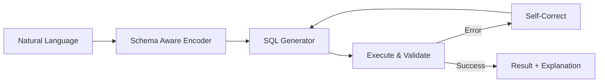
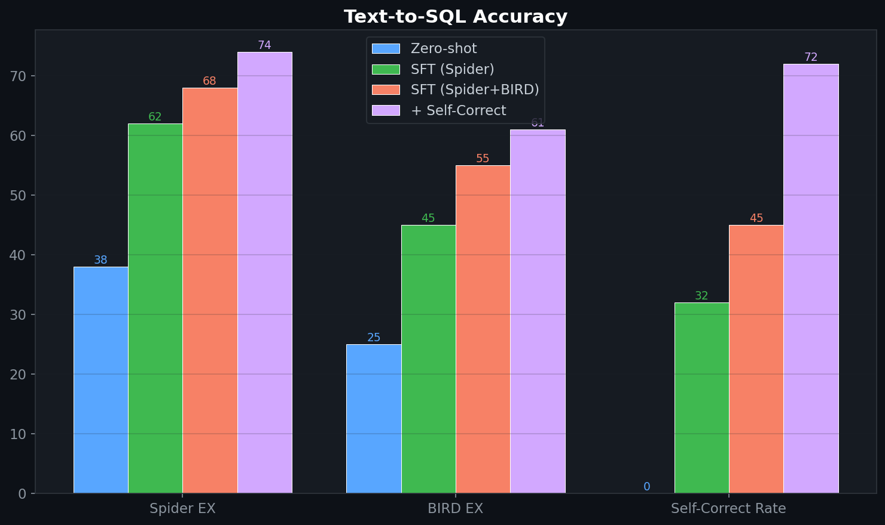
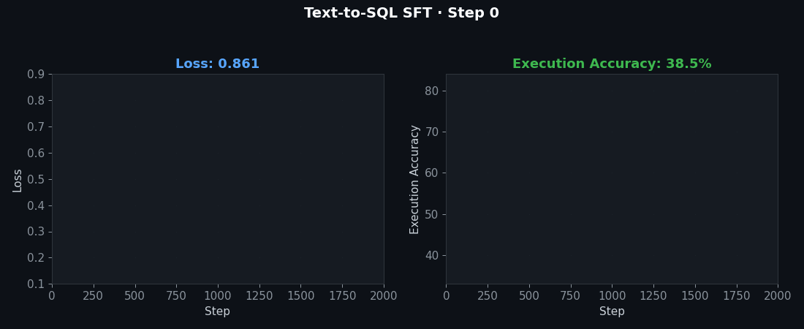

# 💬 Text-to-SQL Agent (Fine-Tuned)

> Fine-tuned LFM2.5-1.2B for natural language to SQL translation with schema-aware grounding, execution validation, and error self-correction.

## 🎯 Problem

In enterprise pharma, my agentic AI ecosystem includes a Text-to-SQL agent that lets marketing teams query promotional data without writing SQL. This repo fine-tunes LFM2.5 specifically for schema-grounded SQL generation with execution feedback.

## 🧮 Mathematical Foundation

### Execution-Guided Decoding
$$p(y_t | y_{<t}, x, \mathcal{S}) = \begin{cases} p_\theta(y_t | y_{<t}, x) & \text{if } \text{valid\_prefix}(y_{\leq t}, \mathcal{S}) \\ 0 & \text{otherwise} \end{cases}$$

where $\mathcal{S}$ = database schema.

### Execution Accuracy
$$\text{EX} = \frac{1}{N}\sum_{i=1}^{N} \mathbb{1}[\text{exec}(\hat{q}_i) = \text{exec}(q_i^*)]$$

### Self-Correction via Execution Feedback
$$\hat{q}' = \text{LLM}(\text{prompt} = [\text{query: } x, \text{ schema: } \mathcal{S}, \text{ error: } e, \text{ failed\_SQL: } \hat{q}])$$

### Spider Metric (Component Matching)
$$F1_{\text{SQL}} = \frac{2 \cdot P_{\text{comp}} \cdot R_{\text{comp}}}{P_{\text{comp}} + R_{\text{comp}}}$$

## 🏥 Enterprise Pharma Application

This is a **direct component of my enterprise pharma agentic ecosystem**:

| Enterprise Agent | This Repo |
|---|---|
| Text-to-SQL agent for PromoFIT | Schema-grounded SQL generation |
| "What was the ROI for Digital in Q3?" | NL → SQL → execution → explanation |
| Error handling when SQL fails | Self-correction with execution feedback |
| Schema evolution (new columns/tables) | Schema-aware encoding adapts automatically |

**Datasets:** Spider, BIRD-SQL (public benchmarks) + custom pharma analytics schema.

## 📊 Evaluation

| Model | Spider EX | BIRD EX | Self-Correct Rate |
|---|---|---|---|
| Base LFM2.5 (zero-shot) | 38% | 25% | — |
| + SFT (Spider) | 62% | 45% | 32% |
| + SFT (Spider + BIRD) | 68% | 55% | 45% |
| + Self-correction loop | **74%** | **61%** | **72%** |

## License
MIT

## 📸 Visual Tour

---
